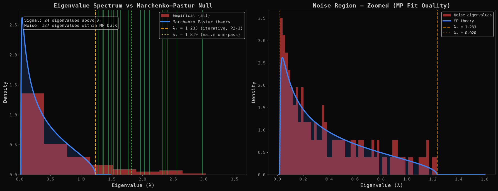
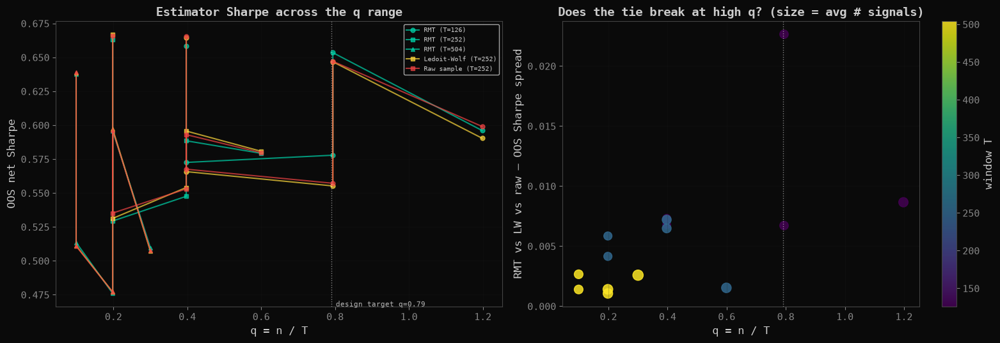

# Eigenportfolios via Random Matrix Theory

**Hypothesis.** Marchenko-Pastur denoising of the sample correlation matrix
— keep eigenvalues above the noise edge λ₊ = σ²(1+√q)², flatten the bulk —
should produce better minimum-variance portfolios than the raw sample matrix,
with Ledoit-Wolf shrinkage as the practitioner benchmark.

**Method.** Hand-rolled MP machinery (eigendecomposition, iterative Laloux
σ² renormalization, three cleaning variants, correlation→covariance handoff
with diagonal reset), walk-forward min-var backtests over 2005–2024 on 151
surviving large caps. IS 2005–2017 / OOS 2018–2024. Code:
[`src/eigenrmt/`](projects/02_eigenportfolio_rmt/src/eigenrmt/).

**The honest headline: the tie that survived five probes.** RMT-cleaned,
Ledoit-Wolf, and raw-sample min-var are statistically indistinguishable OOS —
and the repo tried hard to break that tie: near-death vs smooth survivor
cohorts (spread ≤ 0.006), six random sub-universes (≤ 0.009), and a 15-cell
window×universe grid marching q from 0.10 to 1.20 — **visiting the design-
target q ≈ 0.79 exactly and the formally singular q > 1 corner** (max spread
0.023, at the target cell itself; 0/669 non-optimal solves). Five probes,
zero separations. **The structural eigenvalue work is the contribution** —
the iterative edge correction (14 → 24 real factors per window), the
signature spectrum, the crisis dimensionality collapse — not a portfolio
horse-race the data declined to stage.




Numbers: [`results/tables/p2_metrics.md`](results/tables/p2_metrics.md),
[q grid](results/tables/p2_window_universe_grid.md) ·
Limitations: [`docs/LIMITATIONS.md`](docs/LIMITATIONS.md) ·
Discipline: [`results/OOS_DISCIPLINE.md`](results/OOS_DISCIPLINE.md)

**Regenerate:**
```
jupyter nbconvert --to notebook --execute --inplace projects/02_eigenportfolio_rmt/notebooks/exploration.ipynb
```

---

## Repository layout

- [`projects/02_eigenportfolio_rmt/`](./projects/02_eigenportfolio_rmt/) — the project: [`notebooks/exploration.ipynb`](./projects/02_eigenportfolio_rmt/notebooks/exploration.ipynb) (the full narrative analysis, committed with outputs), `src/` (the extracted package), `config.yaml` (all parameters, schema-validated), `DESIGN.md` (the pre-registered spec), per-module tests.
- [`common/`](./common/) — shared library (data loading, metrics, causal HMM filter, plotting theme) used across the research program.
- [`tests/`](./tests/) — cross-cutting invariants: return-aggregation arithmetic, lookahead/leak detectors, cost-model parity.
- [`results/`](./results/) — citable figures and metric tables, the OOS discipline statement, the change log, and the full program report ([`QUANT_RESEARCH_GUIDE.pdf`](./results/QUANT_RESEARCH_GUIDE.pdf)).

## Setup

```
python -m venv .venv && source .venv/bin/activate
pip install -r requirements.lock
pip install -e ".[dev]"
pytest
```

Market data is downloaded on first notebook run and cached to `data/` (never committed).

## Part of a three-project research program

This repository is one of three companion projects sharing the `common/` library and the same IS/OOS discipline:

1. **Multi-Period Portfolio Optimization** — CVXPY, exact cost-model contract, the restraint result
2. **Eigenportfolios via Random Matrix Theory** — Marchenko-Pastur denoising, the five-probe tie
3. **HMM Regime Detection** — causal filtering, the detector/strategy split

*Author: David Colindres — M.S. Industrial & Systems Engineering + M.A. Econometrics, University of Oklahoma.*
